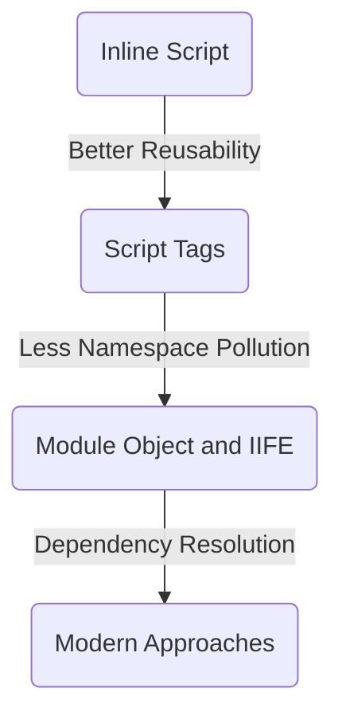

# JavaScript Modules History - Ancient



#### Inline Script

The most original way.

- **Lack of Code Reusability**: If we need to add another page and need some of the functions from this page, we will have to *copy and paste* the code
- **Lack of Dependency Resolution**: You are responsible for having functions to be used come before *main* part of the script.
- **Pollution of global namespace**: All the functions and variables will reside on global scope.

```html
<!DOCTYPE html>
<html>
  <head>
    <meta charset="UTF-8">
    <title>JS Modules</title>
  </head>
  <body>
    <!-- Your HTML Markup goes here -->
    <script type="text/javascript">
        /* Your Javascript Code goes here! */
    </script>
  </body>
</html>
```


#### Script Tags

Now we divide the big chunk of JavaScript into smaller pieces and load them using **<script src=”…”></script>** tags.By separating files into multiple JavaScript files, we can reuse the code. 

But still it lacks dependency resolution and we **have to maintain the order to include files**. 

**Functions and variables are in global scope** which pollutes global namespace.

```html	
<!DOCTYPE html>
<html>
  <head>
    <meta charset="UTF-8">
    <title>JS Modules</title>
  </head>
  <body>
    <!-- Your HTML Markup goes here -->
    <script type="text/javascript" src="file1.js"></script>
    <script type="text/javascript" src="file2.js"></script>
    <script type="text/javascript" src="file3.js"></script>
    <script type="text/javascript" src="main.js"></script>
  </body>
</html>
```


#### Module Object and IIFE(Module Pattern)

We can reduce namespace pollution by using *module object* and *IIFE*.

 ##### module object 

In this approach, we expose only one object to global scope, which contains all the methods and variables we need in the application, as JQuery exposes the only $.

```javascript
/* simplified example */
// my-app.js
var myApp = {
    val0: 0,
    val1: 1
}

// function1.js
myApp.function1 = function() {}
// function2.js
myApp.function2 = function() {}
```


##### IIFE

> An **immediately-invoked function expression** (or **IIFE**, pronounced "iffy")[[1\]](https://www.wikiwand.com/en/Immediately-invoked_function_expression#citenoteAlman1) is a [JavaScript](https://www.wikiwand.com/en/JavaScript) [programming language idiom](https://www.wikiwand.com/en/Programming_idiom)which produces a [lexical scope](https://www.wikiwand.com/en/Scope_(computer_science)) using JavaScript's [function scoping](https://www.wikiwand.com/en/Function_scoping). 
>
> This concept has been referred to as a **self-executing anonymous function**,[[2\]](https://www.wikiwand.com/en/Immediately-invoked_function_expression#citenote2) but ...

Self-executing anonymous function is like this to avoid variables hoisting from within blocks polluting global namespace. Wrapping files with self-executing anonymous function, we can expose nothing to global scope.

```javascript
(function(){ /*... your code goes here ...*/ })();
```


Only with IIFE, we cannot share variables or function among files, So combining module object and IIFE is a practical approach. 


### Modern Approaches

See [modules-modern][./modules-modern.md]


reference: [Brief history of JavaScript Modules][https://medium.com/sungthecoder/javascript-module-module-loader-module-bundler-es6-module-confused-yet-6343510e7bde]