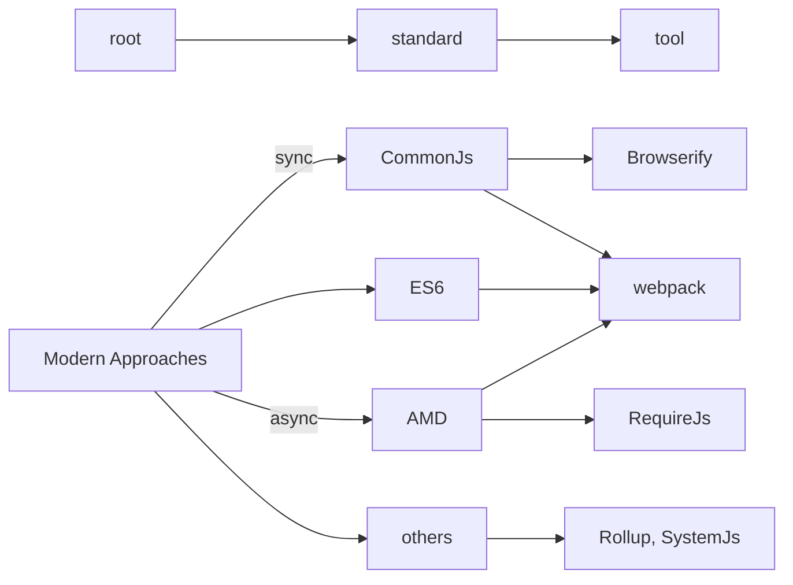

# JavaScript Modules History - Modern

See also [JavaScript Modules History - Ancient][./modules-ancient.md]



CommonJS and AMD solves the two remaining problems with module pattern: **dependency resolution** and **pollution of global scope:** We only need to take care of dependencies for each module or each file. And there is no pollution for global scope.


#### CommonJS (used to named ServerJS) And Browserify

CommonJS is not a JavaScript library. It is a standardization organization.It is like ECMA or W3C. 

* *ECMA*: defines the language specification for JavaScript. 
* *W3C*: defines JavaScript web API, such as DOM or DOM events. 
* *CommonJS*: to define common APIs for web server, desktop and command line applications.

In this case, CommonJS defines APIs for module,  since there is no HTML page and no *<script>* tag on server application. Syntax is like below.

```javascript
// add.js
module.exports = function add(a, b){
  return a+b;
}
// main.js
var add = require('./add');
add(1, 2) === 3; // true
```


**Browserify** is a **module bundler** (a *command line tool*) for CommonJS. 

Since CommonJS syntax is ***for server*** and ***synchronous***, the system will be on halt until the module is ready, Browserify traverse the dependency tree of your codes and bundle them up in a single file on server-side.


#### AMD(Asynchronous Module Definition) And RequireJS

To transfer module syntax from server usage to browser usage, CommonJS proposed several module formats, “Module/Transfer”. One of the proposals, “Module/Transfer/C” later become Asynchronous Module Definition (AMD).

AMD has following format:

```javascript
define([‘add’, ‘reduce’], function(add, reduce){
  return function(){...};
});
```

**RequireJS** is a JavaScript **module loader**. It helps load modules asynchronously as needed. With RequireJS, you can write AMD style module. This is what JQuery uses.


> RequireJS and AMD solve all the problems we had before. However, it creates other slightly less serious problems.
>
> - AMD syntax is too verbose. Since everything is wrapped in ‘define’ function, there are extra indentation for our code. With a small files, it is not much problem, but for a large code base, it can be mentally taxing.
> - List of dependencies in the array must match the list of arguments in the function. If there are many dependencies, it can be hard to maintain the order of the dependencies. If you have dozens of dependencies in your module, and later if you had to remove one in the middle, it can be difficult to find matching module and argument.
> - With current browsers(HTTP 1.1), loading many small files can degrade the performance.


#### Universal Module Definition(UMD) -- Skip it

#### ES6 module syntax

In JavaScript modularization, ES6 syntax is the most recommended syntax. 

JavaScript didn't have module system built into the language. That’s the reason we have so many different way of importing and exporting modules. But that has recently changed. With ES6 language spec, module is part of JavaScript. So the answer to the question is you need to use ES6 module syntax if you want your project to be future-proof.

Unfortunately, there is one problem. Browsers are not ready for this new syntax. But there are tools which support ES6 syntax, like Webpack.

ES6 syntax is like below 

```javascript
import defaultExport from "module-name";
import { export } from "module-name";
//...

export default expression;
export function FunctionName(){...}
export class ClassName {...}
//...
```

 

#### Webpack

Webpack is a **module bundler**. Just like Browserify, it traverses dependency tree and bundles up into a single or more files. It can handle CommonJS, AMD and ES6 modules (and other assets). Under the hook, Webpack has npm dependencies of Browserify.

Comparing to Browserify, Webpack has some more features like *loaders* and *plugins*. 

See more in [webpack](../webpack.md)


#### Rollup

Rollup is another JavaScript ES6 module bundler. Unlike Browserify or Webpack, rollup only includes the codes that are used in your project.


#### SystemJS (skip)


reference: [Brief history of JavaScript Modules][https://medium.com/sungthecoder/javascript-module-module-loader-module-bundler-es6-module-confused-yet-6343510e7bde]