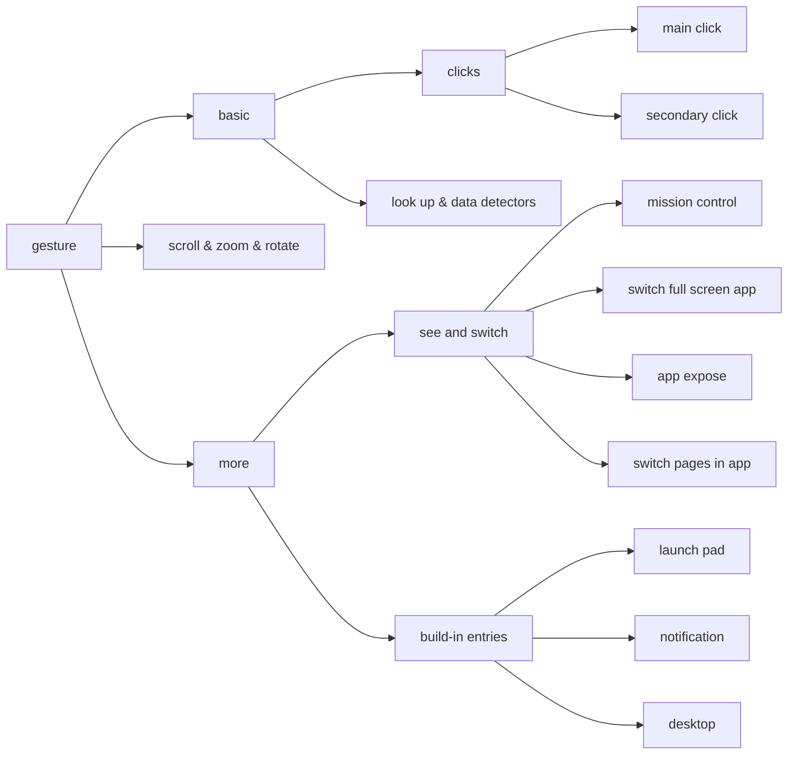

## Features

#### Trackpad 

```mermaid
graph LR
gesture[gesture] --> basic[basic]
basic --> clk[clicks]
clk --> a[main click]
clk --> b[secondary click]

basic --> c[look up & data detectors]

gesture --> d[scroll & zoom & rotate]
gesture --> more[more]
more --> e[see and switch]
e --> f[mission control]
e --> g[switch full screen app]
e --> h[app expose]
e --> i[switch pages in app]

more --> be[build-in entries]
be --> lp[launch pad]
be --> nt[notification]
be --> dt[desktop]
```

### Utility

1. system preference
2. activity monitor
3. console
4. terminal