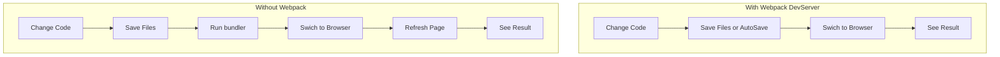

## webpack

### Definition 

> At its core, **webpack** is a ***static module bundler*** for modern JavaScript applications. When webpack processes your application, it internally builds a *dependency graph* which maps every module your project needs and generates one or more *bundles*.

**static**: You need to bundle your resources before using them rather than bundle modules at runtime.

**module**: [modules-ancient](./basic/modules-ancient), [modules-modern][./basic/modules-modern]


#### Install

Initialize a **npm** package first if 'package.json' is not existed.

```bash
npm init
```

install **webpack**

```bash
npm i webpack -D
```

To run webpack in console, you need **webpack-command**

```bash
npm i webpack-command -D
```


### Configure

[webpack/configure](https://webpack.js.org/configuration/)

A common version with babel 7.x.

But what is Node.js, what is webpack what is babel.

```javascript
const path = require("path")

module.exports = function(env) {
  return {
    entry: "./src/index.js",  //could be an object if needed
    output: {
      path: path.resolve(__dirname),
      filename: "min-jquery.js"
    },
    watch: env.mode === "development",
    module: {
      rules: [
        {
          test: /\.js/,
          use: {
            loader: 'babel-loader',
            options: {
              presets: ['env']
            }
          }
        }
      ]
    }
  }
}
```


### Webpack DevServer

Webpack DevServer is a development server that provides ***live reloading***. 

After we change codes in front-end development, there used to be several steps to follow: 

1. Save files
2. Run bundler command if needed
3. Switch to Browser page
4. Refresh Page
5. See the result

DevServer builds a simple server and frees us from the ***F5*** key. With DevServer running, once we change codes watched by webpack, after save files, we can just switch to browser and see the result without refresh the page. 



##### Easy Usage

```bash
// Install
npm i webpack-dev-server webpack-cli -D

// package.json
scripts: {
    "start:dev": "webpack-dev-server"
}
```

DevServer use *webpack.config.js* as configuration file, option *devServer* is provided to configure DevServer.

**Notice**: The webpack-dev-server doesn't write to disk. It serves the result from memory.