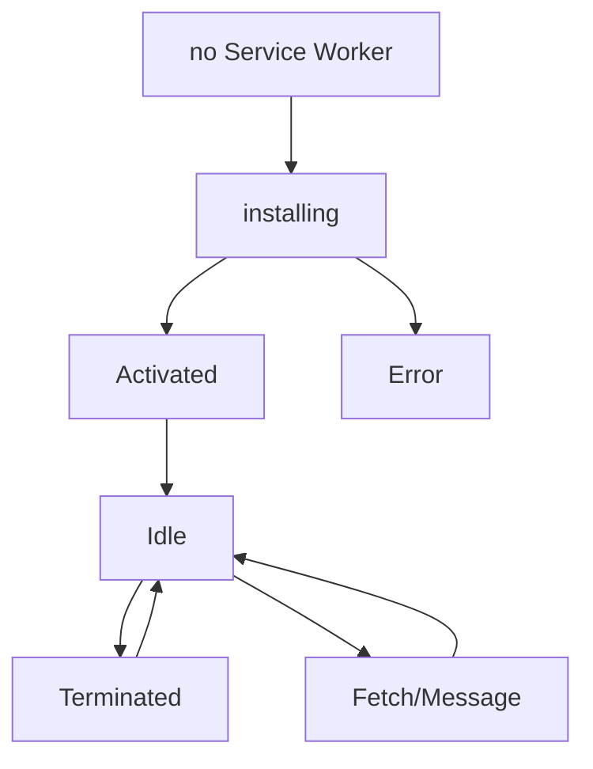

## Service Worker有什么用

### Motivation

离线体验、周期性的同步、推送功能等原生app的功能在web上原本都难以实现。Service Workder(sw)就是要支撑这些功能的实现。

### 是什么

1. 浏览器支持的后台脚本
2. 与web页面与用户交互分离。

一个重要特性是做请求拦截，包括处理响应的缓存。

1. 不能直接访问DOM，通过postMessage与页面交互
2. 是一个可编程的网络代理，帮你在请求发出去之前对其进行处理。
3. 即用即走，不能维护全局状态。如果有的话，用indexedDb

### 生命周期

sw的生命周期独立于页面。

1. 需要注册sw，注册后浏览器会后台安装
2. 安装的时候常常加载缓存资源.加载资源失败下次会重试
3. activate步骤适合处理旧缓存的管理

怎么理解terminated状态回到Idle？

### 前提

1. 浏览器支持。目前较为广泛
2. 需要https，保证安全
3. 注册sw